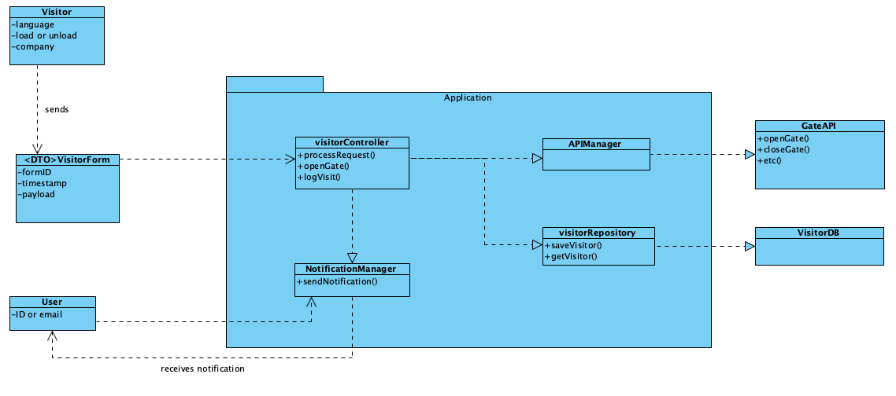
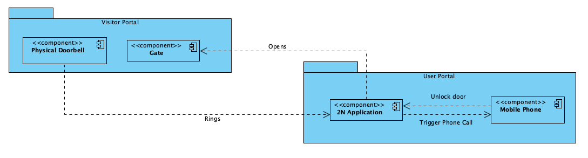
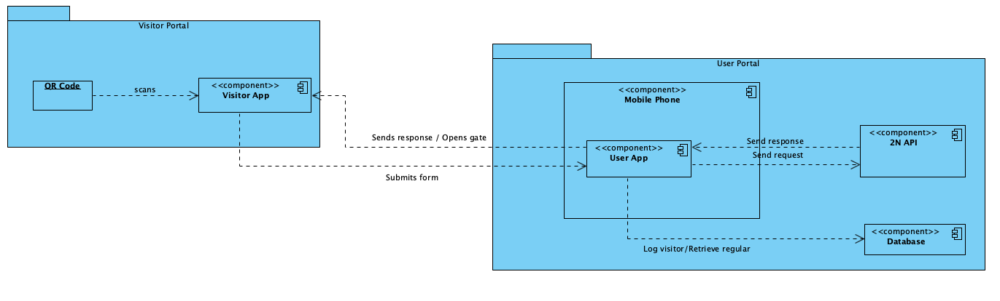

# Analysis Artefacts

This folder contains all analysis materials produced during the early phase of the **Gate Access Management Application**. The purpose of this analysis is to identify the problem, requirements, and risks before moving on to design and prototyping.

## Contents

- [Project Objectives](../ProjectObjectives.md)
  
  Describes the scope of the project, such as User Requirements, Functional and Non-Functional requirements, and scope. This document will evolve with the development of the project. 

- [Use Cases](useCases/UseCases.md)

  Briefly describe the main interactions of users with the system. This provides a clearer view of the requirements of the application.

- [Interviews](Interviews.md)

  Interviews conducted with the main stakeholders - the application users. This helps better understand the real-world challenges and constraints.

- [Glossary](Glossary.md)

  Contains the exact definitions of terminology used throughout the application development process, in order to promote clarity and transparency.

- **Domain Models**  
  Conceptual diagrams representing the key entities and their relationships in the system, including Visitors, Forms, Visit Requests, Doorbells, Users, and Notifications. These models abstract the real-world concepts that the system must support.
  - First Draft:
    

- **Component Diagrams**  
  High-level architecture diagrams showing the components of both the current and planned systems, including Visitor Portal, User Portal, Doorbell API, Form Database, and Notification Service.
  - Current system:
    
  - Target system:
    

- **Comparative Analysis Notes**  
  Observations and comparisons between the current doorbell app and the planned solution, highlighting workflow improvements, flexibility, data collection, and integration potential.

  - **Workflow Diagrams**  
  Visual representations of the current system (physical doorbell → phone call) and the planned system (QR code form → API-triggered ring). These illustrate the differences in user interaction and system behavior.

## Purpose
The artefacts in this folder serve to:

- Provide a **clear understanding of the current system** and its limitations.  
- Capture the **requirements and constraints** for the planned solution.  
- Support decision-making regarding workflow design, technical approach, and risk management.  

## How to Use

1. Browse the diagrams to understand the current and planned workflows.  
2. Review the risk table to see potential issues and contingency plans.  
3. Refer to the comparative analysis notes when evaluating design decisions.  

> **Note:** These artefacts are intended for analysis purposes only and may evolve as the project moves into design and prototyping phases.
