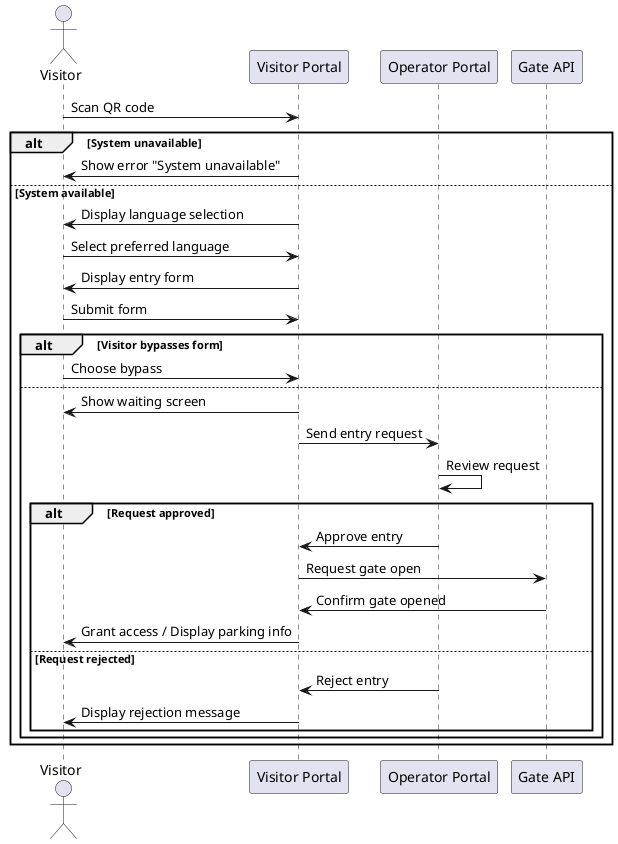

# Request Access

Main use case from Visitor's side.

## Use Case
| **Name:**                 | Request Facility Access                                                                                                                                                                                                                                                                                              |
|---------------------------|----------------------------------------------------------------------------------------------------------------------------------------------------------------------------------------------------------------------------------------------------------------------------------------------------------------------|
| **Actor:**                | Visitor                                                                                                                                                                                                                                                                                                              |
| **Description:**          | Visitor requests entry to the facility, providing necessary information and receiving access instructions.                                                                                                                                                                                                           |
| **Pre-condition:**        | Visitor is at the facility gate.                                                                                                                                                                                                                                                                                     |
| **Scenario (Main Flow):** |                                                                                                                                                                                                                                                                                                                      |
|                           | 1. Visitor scans the QR code at the gate.                                                                                                                                                                                                                                                                            |
|                           | 2. System checks availability.                                                                                                                                                                                                                                                                                       |
|                           | 3. System displays available languages.                                                                                                                                                                                                                                                                              |
|                           | 4. Visitor selects preferred language.                                                                                                                                                                                                                                                                               |
|                           | 5. System displays entry form.                                                                                                                                                                                                                                                                                       |
|                           | 6. Visitor fills in the entry form.                                                                                                                                                                                                                                                                                  |
|                           | 7. Visitor submits the form.                                                                                                                                                                                                                                                                                         |
|                           | 8. Visitor may choose to bypass the form if eligible.                                                                                                                                                                                                                                                                |
|                           | 9. If form is submitted or bypassed, system sends request to Operator.                                                                                                                                                                                                                                               |
|                           | 10. Operator reviews the request and either approves or rejects it.                                                                                                                                                                                                                                                  |
|                           | 11. If approved, system requests gate to open via Gate API.                                                                                                                                                                                                                                                          |
|                           | 12. System confirms gate has opened and grants access to the visitor (displays parking info).                                                                                                                                                                                                                        |
|                           | 13. If rejected, system displays a rejection message to the visitor.                                                                                                                                                                                                                                                 |
| **Extensions:**           | [UC-03: Scan QR Code](#uc-03-scan-qr-code)                                                                                                                                                                                                                                                                        |
|                           | [UC-05: Choose Language](#uc-05-choose-language)                                                                                                                                                                                                                                                                  |
|                           | [UC-06: Fill Entrance Form](#uc-06-fill-entrance-form)                                                                                                                                                                                                                                                            |
|                           | [UC-10: Regular Visitor](#uc-10-regular-visitor)                                                                                                                                                                                                                                                                     |
| **Exceptions:**           | 1.a QR Code is illegible / visitor doesn’t have a phone → fallback sign displays instructions.  1.b System unavailable → system displays "temporarily unavailable" message.  2.a Form invalid → system highlights missing/invalid fields.  3.a Gate fails to open → system displays error and logs attempt. |
| **Result:**               | Visitor request is submitted and processed by the operator; access granted or rejected accordingly.                                                                                                                                                                                                                  |

## Linked User Stories

- [US-01: Visitor QR Code Scan](UserStories.md#us-01-visitor-qr-code-scan)
- [US-02: Set Application Language](UserStories.md#us-02-set-application-language)
- [US-03: Get Security Information](UserStories.md#us-03-get-security-information)
- [US-04: Choose to Bypass Form](UserStories.md#us-04-choose-to-bypass-form)
- [US-05: Fill in Entrance Form](UserStories.md#us-05-fill-in-entrance-form)

## Acceptance Criteria

- Visitor can scan the QR code at the facility gate.
- System displays available languages.
- Visitor can select a preferred language (defaults to Dutch if none selected).
- System displays safety instructions.
- Visitor can fill in the entry form with required fields (to be defined).
- Visitor can submit the form.
- Visitor can bypass form filling if pre-approved.
- System successfully sends the request to the operator.
- Operator can approve or reject the request.
- Gate opens only if request is approved; visitor receives confirmation and parking information.

## Test Scenarios

| Scenario ID    | Description                   | Steps                                                                                             | Expected Result                                                                                          |
|----------------|-------------------------------|---------------------------------------------------------------------------------------------------|----------------------------------------------------------------------------------------------------------|
| TS-01          | Successful request submission | 1. Scan QR code 2. Choose language 3. Fill form 4. Submit                                | Form submitted and sent to operator; visitor redirected to waiting screen; access granted after approval |
| TS-02          | Visitor bypasses form         | 1. Scan QR code 2. Choose language 3. Select bypass option 4. Submit                     | Request sent to operator; waiting screen shown; access granted after approval                            |
| TS-03          | QR code scan fails            | 1. Attempt to scan QR code 2. QR code unreadable                                               | Physical fallback: sign with instructions if QR is unavailable                                           |
| TS-04          | Entry form incomplete         | 1. Scan QR code 2. Select language 3. Submit form with missing required fields              | Show error: "Please fill all required fields"                                                            |
| TS-05          | System unavailable            | 1. Scan QR code 2. System down / unresponsive                                                  | Show error: "System unavailable"                                                                         |
| TS-06          | Gate fails to open            | 1. Form submitted and approved 2. Gate API fails                                               | Show error: "Unable to open gate, contact operator"; system logs attempt                                 |
| TS-07          | Operator rejects request      | 1. Complete form and submit 2. Operator rejects request                                        | Show rejection message to visitor                                                                        |
| TS-08          | Multiple submissions          | 1. Complete and submit form 2. Attempt to submit again accidentally                            | System handles duplicates appropriately (either reject or process as separate request)                   |
| TS-09          | Visitor leaves mid-process    | 1. Scan QR code 2. Start form 3. Exit before submission                                     | System does not create request; optionally logs partial attempt                                          |

## Basic Sequence Diagram

