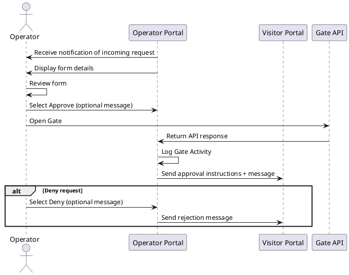
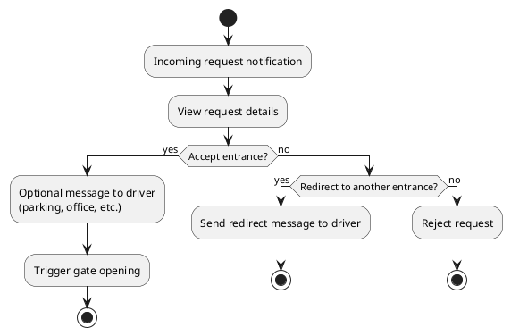

# UC-02: Grant/Deny Access

| **Name:**                 | Grant/Deny Access                                                                 |
|---------------------------|-----------------------------------------------------------------------------------|
| **Actor:**                | Operator                                                                          |
| **Description:**          | Operator reviews visitor submissions and decides whether to grant access.         |
| **Pre-condition:**        | Visitor has submitted a request, operator is logged into the portal               |
| **Scenario (Main Flow):** |                                                                                   |
|                           | 1. Operator receives notification of incoming form and clicks on it.              |
|                           | 2. System displays the form's contents.                                           |
|                           | 3. Operator reviews form's details.                                               |
|                           | 4. Operator selects “Approve” or “Reject” and optionally adds a message.          |
|                           | 5. System sends response to visitor (approval instructions or rejection message). |
| **Extensions:**           | [UC-07: Review Form](#uc-07-review-form)                                       |
|                           | [UC-09: Open Gate](#uc-09-open-gate)                                           |
|                           | [UC-13: Receive Notification](#uc-13-receive-notification)                        |
| **Exceptions:**           | [UC-11: Wrong Address](#uc-11-wrong-address)                                   |
|                           | [UC-14: Operator unavailable](#uc-14-operator-unavailable)                        |
| **Result:**               | Visitor is either granted or denied access to the facility.                       |

## Linked User Stories

- [US-06: Visitor Response](UserStories.md#us-06-receive-response-with-information)
- [US-08: Notification of Incoming Visitor](UserStories.md#us-08-notification-of-incoming-visitor)
- [US-09: Receive Translated Form](UserStories.md#us-09-receive-translated-form)
- [US-10: Approve/Deny Form](UserStories.md#us-10-approvedeny-form)

## Acceptance Criteria
- Operator receives notification of incoming visitor request
- Operator can view the submitted form and its details
- Operator can approve or deny the request
- Operator can optionally add a message when approving/denying
- System sends response to visitor with instructions or rejection message
- Optional: Operator can open the gate directly from the portal

## Test Scenarios
| Scenario ID   | Description                   | Steps                                                                                        | Expected Result                                                    |
|---------------|-------------------------------|----------------------------------------------------------------------------------------------|--------------------------------------------------------------------|
| TS-01         | Approve visitor request       | 1. Receive notification 2. Open form 3. Review details 4. Approve request           | Visitor receives approval instructions; system logs action         |
| TS-02         | Deny visitor request          | 1. Receive notification 2. Open form 3. Review details 4. Deny request              | Visitor receives rejection message; system logs action             |
| TS-03         | Approve with optional message | 1. Receive notification 2. Open form 3. Review details 4. Approve 5. Add message | Visitor receives instructions including operator message           |
| TS-04         | Deny with optional message    | 1. Receive notification 2. Open form 3. Review details 4. Deny 5. Add message    | Visitor receives rejection including operator message              |
| TS-05         | System fails to send response | 1. Approve or deny request 2. Network/API error occurs                                    | Show error to operator: "Unable to send response. Try again later" |
| TS-06         | Open gate directly            | 1. Receive notification 2. Open form 3. Approve request 4. Select “Open Gate”       | Gate opens; visitor can enter; system logs gate operation          |

## Basic Sequence Diagram

## Flow Diagram 

