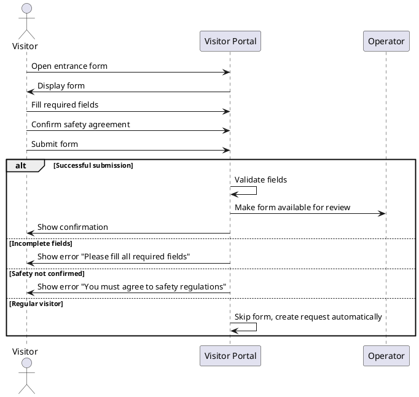

# UC-06: Fill Entrance Form

| **Name:**                 | Fill Entrance Form                                                        |
|---------------------------|---------------------------------------------------------------------------|
| **Actor:**                | Visitor                                                                   |
| **Description:**          | Visitor provides basic required information to request access.            |
| **Pre-condition:**        | Visitor has selected a language and accessed the entry form.              |
| **Scenario (Main Flow):** |                                                                           |
|                           | 1. Visitor fills in required fields (e.g., name, purpose, delivery info). |
|                           | 2. Visitor confirms agreement with safety regulations.                    |
|                           | 3. Visitor submits the form.                                              |
| **Extensions:**           | - [UC-10: Regular Visitor]()                                              |
| **Exceptions:**           | - Visitor leaves form incomplete → system requests missing fields.        |
|                           | - Visitor abandons the process → no request is created.                   |
| **Result:**               | Form is submitted and becomes available for operator review.              |
                                                                                                         
## Linked User Stories

### Acceptance Criteria
- Visitor can access the entrance form after selecting language.
- Visitor can fill in basic required fields (delivery info).
- System validates that all required fields are filled.
- Visitor can successfully submit the form.
- System makes the form available for operator review.
- If visitor skips the form filling process, the request is still sent to the operator.
- If visitor abandons the process, no request is created.

---

### Test Scenarios

| Scenario ID | Description                 | Steps                                                                 | Expected Result                                                         |
|-------------|-----------------------------|-----------------------------------------------------------------------|-------------------------------------------------------------------------|
| TS-01       | Successful form submission  | 1. Open form 2. Fill required fields 3. Submit                  | Form is submitted and available to operator                             |
| TS-02       | Incomplete form             | 1. Open form 2. Leave one required field empty 3. Submit        | System shows error: "Please fill all required fields"                   |
| TS-03       | Regular visitor (extension) | 1. Open form 2. Click on "Visitor" (or "Skip") button 3. Submit | Visitor bypasses form, request created automatically                    |
| TS-04       | Visitor abandons form       | 1. Open form 2. Do not submit and close session                    | No request is created, system may log incomplete attempt                |

---

### Sequence Diagram

