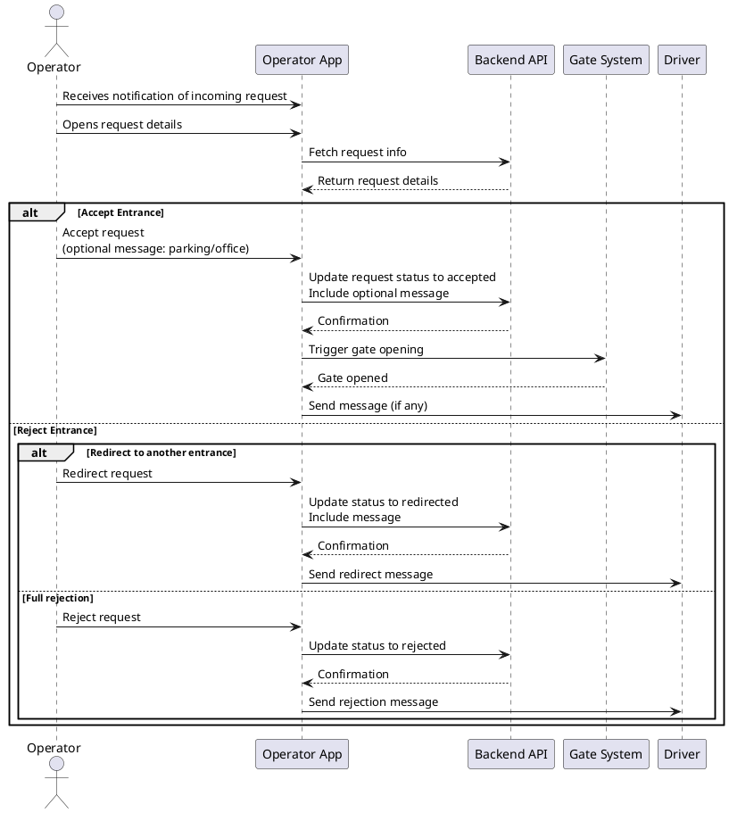

# UC-07: Review Form

| **Name:**                 | Review Form                                                                                                 |
|---------------------------|-------------------------------------------------------------------------------------------------------------|
| **Actor:**                | Operator                                                                                                    |
| **Description:**          | Operator reviews the submitted visitor form and checks for correctness.                                     |
| **Pre-condition:**        | Visitor has submitted a form; Operator has access to the portal.                                            |
| **Scenario (Main Flow):** |                                                                                                             |
|                           | 1. Operator opens the pending requests list.                                                                |
|                           | 2. Operator reviews visitor details, delivery info, and safety confirmation.                                |
|                           | 3. Operator decides to accept or reject the visitor.                                                        |
|                           | 4. If accepted, Operator optionally adds a message (e.g., parking, office).                                 |
|                           | 5. If accepted, Operator triggers gate opening and sends message to driver.                                 |
|                           | 6. If rejected, Operator can redirect to another entrance or fully reject.                                  |
| **Extensions:**           | [UC-08: Approve/Reject Visitor]                                                                             |
| **Exceptions:**           | [UC-11: Wrong Address]                                                                                      |
| **Result:**               | Operator successfully processes the visitor request, including sending messages or triggering gate actions. |

## Linked User Stories

### Acceptance Criteria
- Operator can view all pending visitor requests.
- Operator can read visitor details.
- Operator can approve a visitor request.
- Operator can send an optional message when approving (parking location, office direction).
- Operator can trigger gate opening when approving.
- Operator can reject a visitor request fully or redirect to another entrance.
- System updates request status accordingly and notifies the driver.

### Test Scenarios

| Scenario ID | Description                          | Steps                                                                                                   | Expected Result                                                                           |
|-------------|--------------------------------------|---------------------------------------------------------------------------------------------------------|-------------------------------------------------------------------------------------------|
| TS-01       | Approve visitor with message         | 1. Open pending requests 2. Review visitor info 3. Approve 4. Add message 5. Submit         | Visitor approved, gate opens, message sent to driver                                      |
| TS-02       | Approve visitor without message      | 1. Open pending requests 2. Review visitor info 3. Approve 4. Leave message empty 5. Submit | Visitor approved, gate opens, no message sent                                             |
| TS-03       | Reject visitor (full rejection)      | 1. Open pending requests 2. Review visitor info 3. Reject request 4. Submit                    | Visitor request rejected, driver receives rejection message                               |
| TS-04       | Redirect visitor to another entrance | 1. Open pending requests 2. Review visitor info 3. Redirect 4. Add instructions 5. Submit   | Visitor redirected, driver receives instructions for alternate entrance                   |
| TS-05       | Wrong address exception              | 1. Open pending requests 2. Visitor form has wrong address 3. Operator notices issue              | Operator triggers [UC-11: Wrong Address], system handles correction                       |

### Sequence Diagram

### 