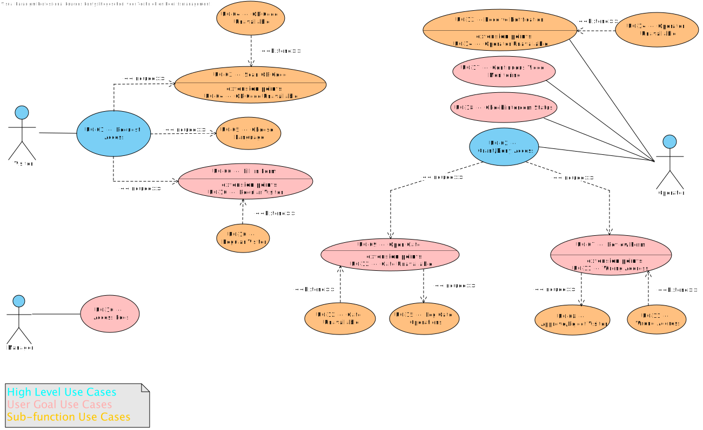

# Use Cases

This document serves as an overview of all the use cases considered for the Gate Access Control Application. 
They are classified by scope level (High-Level, User Goal, and Sub-Function). 

1. Request Facility Access [UC-01](#uc-01-request-facility-access)
2. Grant/Deny Access [UC-02](#uc-02-grantdeny-access)
3. *Scan QR Code [UC-03](#uc-03-scan-qr-code)* *(Extension in UC-01)*
4. *QR Code Unavailable [UC-04](#uc-04-qr-code-unavailable)* *(exception in UC-01)*
5. Choose Language [UC-05](#uc-05-choose-language)
6. Fill Entrance Form [UC-06](#uc-06-fill-entrance-form)
7. *Review Form [UC-07](#uc-07-review-form)* *(Exception in UC-02)*
8. *Approve/Reject Visitor [UC-08](#uc-08-approvereject-visitor)* *(extension in UC-07)*
9. Open Gate [UC-09](#uc-09-open-gate)
10. *Regular Visitor [UC-10](#uc-10-regular-visitor)* *(extension in UC-01)*
11. *Wrong Address [UC-11](#uc-11-wrong-address)* *(exception in UC-02)*
12. *Gate Unavailable [UC-12](#uc-12-gate-unavailable)* *(exception in UC-09)*
13. Receive Notification [UC-13](#uc-13-receive-notification)
14. *Operator Unavailable [UC-14](#uc-14-operator-unavailable)* *(exception in UC-13)*
15. Log Gate Operations [UC-15](#uc-15-log-gate-operations)
16. Access Logs [UC-16](#uc-16-access-logs)
17. Continuous Video Monitoring [UC-17](#uc-17-gate-video-feedback)
18. Check Intercom Status [UC-18](#uc-18-check-intercom-status)

## Use Case Overview & Documentation

| Level            | Use Case                                                         | Complexity | Documentation Needed                                                          |
|------------------|------------------------------------------------------------------|------------|-------------------------------------------------------------------------------|
| **High level**   | [UC-01: Request Facility Access](UC01-RequestAccess.md)        | High       | Full acceptance criteria, test scenarios, sequence/activity diagrams, UI flow |
|                  | [UC-02: Grant/Deny Access](UC02-GrantDenyAccess.md)            | High       | Full acceptance criteria, test scenarios, sequence/activity diagrams, UI flow |
| **User goal**    | [UC-06: Fill Entrance Form](UC06-FillEntranceForm.md)          | Medium     | Acceptance criteria, key test scenarios, short sequence diagram               |
|                  | [UC-07: Review Form](./UC07-ReviewForm)                          | Medium     | Acceptance criteria, key test scenarios, short sequence diagram               |
|                  | [UC-09: Open Gate](#uc-09-open-gate)                             | High       | Acceptance criteria, key test scenarios, short sequence diagram               |
|                  | [UC-10: Regular Visitor](#uc-10-regular-visitor)                 | Light      | Acceptance criteria, key test scenarios, short sequence diagram               |
|                  | [UC-16: Access Logs](#uc-16-access-logs)                         | Medium     | Acceptance criteria, limited test scenarios                                   |
|                  | [UC-17: Continuous Video Monitoring](#uc-17-gate-video-feedback) | High       | Acceptance criteria, 1–2 scenarios if implemented                             |
|                  | [UC-18: Check Intercom Status](#uc-18-check-intercom-status)     | Medium     | Acceptance criteria                                                           |
| **Sub-function** | [UC-03: Scan QR Code](#uc-03-scan-qr-code)                       | Light      | Covered as a step in UC-01, no standalone diagram                             |
|                  | [UC-04: QR Code Unavailable](#uc-04-qr-code-unavailable)         | Light      | Exception in UC-03, no diagram                                                |
|                  | [UC-05: Choose Language](#uc-05-choose-language)                 | Light      | Covered as a step in UC-01, no standalone diagram                             |
|                  | [UC-08: Approve/Reject Visitor](#uc-08-approvereject-visitor)    | Light      | Covered in UC-07, no diagram                                                  |
|                  | [UC-11: Wrong Address](#uc-11-wrong-address)                     | Light      | Exception case inside UC-01, no standalone diagram                            |
|                  | [UC-12: Gate Unavailable](#uc-12-gate-unavailable)               | Light      | Exception case, only edge test coverage                                       |
|                  | [UC-13: Receive Notification](#uc-13-receive-notification)       | Medium     | Mentioned in UC-02, no standalone diagram                                     |
|                  | [UC-14: Operator Unavailable](#uc-14-operator-unavailable)       | Light      | Extension of UC-03, no diagram                                                |
|                  | [UC-15: Log Gate Operations](#uc-15-log-gate-operations)         | Light      | Mentioned in UC-09/UC-02 as logging, no standalone diagram                    |

## High Level Use Cases

### UC-01: Request Facility Access

Specified in [UC01-RequestAccess](UC01-RequestAccess.md)

### UC-02: Grant/Deny Access

Specified in [UC02-RequestAccess](UC02-GrantDenyAccess.md)

## User Goal Use Cases

### UC-06: Fill Entrance Form

Specified in [UC06-FillEntranceForm](UC06-FillEntranceForm.md)

### UC-07: Review Form

Specified in [UC07-ReviewForm](UC07-ReviewForm.md)

### UC-09: Open Gate

| **Name:**                 | Open Gate                                                |
|---------------------------|----------------------------------------------------------|
| **Actor:**                | Operator                                                 |
| **Description:**          | Operator opens the gate to allow visitor entry.          |
| **Pre-condition:**        | Visitor is approved for access                           |
| **Scenario (Main Flow):** |                                                          |
|                           | 1. Operator triggers gate opening.                       |
| **Extensions:**           | [UC-15: Log Gate Operations](#uc-15-log-gate-operations) |
| **Exceptions:**           | [UC-12: Gate Unavailable](#uc-12-gate-unavailable)       |
| **Result:**               | Visitor can enter the facility.                          |

### UC-16: Access Logs

| **Name:**                 | Access Logs                                                                                 |
|---------------------------|---------------------------------------------------------------------------------------------|
| **Actor:**                | Manager                                                                                     |
| **Description:**          | Allows the manager to download gate operation logs for auditing and data analysis purposes. |
| **Pre-condition:**        | Gate operation logs exist in the system database.                                           |
| **Scenario (Main Flow):** | 1. Manager opens the log portal.                                                            |
|                           | 2. Manager searches or filters logs as needed.                                              |
|                           | 3. Manager downloads selected logs if required.                                             |
|                           | 4. System provides requested logs.                                                          |
| **Extensions:**           | None                                                                                        |
| **Exceptions:**           | - Download fails → system shows error message and logs the failure.                         |
| **Result:**               | Manager successfully accesses, searches, and optionally downloads gate logs for analysis.   |

### UC-17: Gate Video Feedback

| **Name:**                 | Continuous Video Monitoring                                                                                          |
|---------------------------|----------------------------------------------------------------------------------------------------------------------|
| **Actor:**                | Operator                                                                                                             |
| **Description:**          | Allows the operator to access live video from the gate at any time via API. This is independent of visitor requests. |
| **Pre-condition:**        | The video monitoring system is connected and accessible via API.                                                     |
| **Scenario (Main Flow):** | 1. Operator opens the video monitoring interface.                                                                    |
|                           | 2. Operator selects the gate or camera feed to view.                                                                 |
|                           | 3. Live video feed is displayed.                                                                                     |
|                           | 4. Operator may continue monitoring as long as needed.                                                               |
| **Extensions:**           | None                                                                                                                 |
| **Exceptions:**           | - Video feed unavailable → system notifies operator and allows retry.                                                |
| **Result:**               | Operator can continuously monitor the gate via live video feed for situational awareness.                            |

## Sub-Function Use Cases 

### UC-03: Scan QR Code

| **Name:**                 | Scan QR Code                                                          |
|---------------------------|-----------------------------------------------------------------------|
| **Actor:**                | Visitor                                                               |
| **Description:**          | Visitor scans the QR code at the gate to initiate the access request. |
| **Pre-condition:**        | Visitor is at the facility gate                                       |
| **Scenario (Main Flow):** |                                                                       |
|                           | 1. Visitor points device at QR code.                                  |
|                           | 2. System reads QR code and validates it.                             |
|                           | 3. System proceeds to display entry options and language selection.   |
| **Extensions:**           | None                                                                  |
| **Exceptions:**           | [UC-04: QR Code Unavailable](#uc-04-qr-code-unavailable)              |
| **Result:**               | Visitor proceeds to the next step in the access process.              |

## UC-05: Choose Language

| **Name:**                 | Choose Language                                                      |
|---------------------------|----------------------------------------------------------------------|
| **Actor:**                | Visitor                                                              |
| **Description:**          | Visitor selects their preferred language for instructions and forms. |
| **Pre-condition:**        | Visitor has accessed the system                                      |
| **Scenario (Main Flow):** |                                                                      |
|                           | 1. System displays available languages.                              |
|                           | 2. Visitor selects preferred language.                               |
|                           | 3. System translates interface and form to selected language.        |
| **Extensions:**           | None                                                                 |
| **Exceptions:**           | None                                                                 |
| **Result:**               | Visitor sees all information in the chosen language.                 |

## UC-13: Receive Notification

| **Name:**                 | Receive notification of incoming visitor                                      |
|---------------------------|-------------------------------------------------------------------------------|
| **Actor:**                | Operator                                                                      |
| **Description:**          | Operator receives a phone-call like notification when a new form is submitted |
| **Pre-condition:**        | Operator has application installed                                            |
| **Scenario (Main Flow):** |                                                                               |
|                           | 1. Visitor submits form.                                                      |
|                           | 2. System triggers notification.                                              |
|                           | 3. Operator opens portal to view request.                                     |
| **Extensions:**           | None                                                                          |
| **Exceptions:**           | [UC-14: Operator Unavailable](#uc-14-operator-unavailable)                    |
| **Result:**               | Operator can view the request sent by the incoming driver.                    |

## UC-15: Log Gate Operations

| **Name:**                 | Log Gate Operations                                                                              |
|---------------------------|--------------------------------------------------------------------------------------------------|
| **Actor:**                | System, Manager                                                                                  |
| **Description:**          | Automatically records all gate activity in the system database for auditing and review purposes. |
| **Pre-condition:**        | Gate operations are performed (e.g., gate opens/closes).                                         |
| **Scenario (Main Flow):** | 1. System detects a gate operation.                                                              |
|                           | 2. System logs the operation details (timestamp, etc).                                           |
|                           | 3. Log entry is stored in the database.                                                          |
|                           | 4. Manager can access logs via portal if needed.                                                 |
| **Extensions:**           | [UC-16](#uc-16-access-logs)                                                                      |
| **Exceptions:**           | - Database write fails → system retries and logs error for administrator review.                 |
| **Result:**               | All gate operations are recorded and available for later access by the manager.                  |

## UC-18: Check Intercom Status

| **Name:**                 | Check Intercom Status                                                                          |
|---------------------------|------------------------------------------------------------------------------------------------|
| **Actor:**                | Gate Operator                                                                                  |
| **Description:**          | Allows the operator to view the status of the intercom (available or unavailable) at any time. |
| **Pre-condition:**        | Intercom system is connected and operational.                                                  |
| **Scenario (Main Flow):** | 1. Operator opens the intercom status interface.                                               |
|                           | 2. System displays the current intercom status (available/not available).                      |
|                           | 3. Operator may take appropriate action if needed.                                             |
| **Extensions:**           | None                                                                                           |
| **Exceptions:**           | - Intercom status unavailable → system notifies operator and allows retry.                     |
| **Result:**               | Operator is aware of intercom availability and can act accordingly.                            |

## Removed UC's (too granular)

### UC-04: QR Code Unavailable

| **Name:**                 | QR Code Unavailable                                                |
|---------------------------|--------------------------------------------------------------------|
| **Actor:**                | Visitor                                                            |
| **Description:**          | Provides fallback instructions when the QR code cannot be scanned. |
| **Pre-condition:**        | Visitor attempts to scan the QR code                               |
| **Scenario (Main Flow):** |                                                                    |
|                           | 1. Visitor attempts to scan QR Code.                               |
|                           | 2. System is unavailable, displays fallback message.               |
| **Extensions:**           | None                                                               |
| **Exceptions:**           | None                                                               |
| **Result:**               | Visitor can continue access process via fallback method.           |

### UC-08: Approve/Reject Visitor

| **Name:**                 | Approve/Reject Visitor                                                            |
|---------------------------|-----------------------------------------------------------------------------------|
| **Actor:**                | Operator                                                                          |
| **Description:**          | Operator approves or rejects a visitor based on submitted information.            |
| **Pre-condition:**        | Visitor form has been reviewed, operator is logged into the portal.               |
| **Scenario (Main Flow):** |                                                                                   |
|                           | 1. Operator receives notification of incoming form and clicks on it.              |
|                           | 2. System displays the form's contents.                                           |
|                           | 3. Operator reviews form's details.                                               |
|                           | 4. Operator selects “Approve” or “Reject” and optionally adds a message.          |
|                           | 5. System sends response to visitor (approval instructions or rejection message). |
| **Extensions:**           | [UC]                                                                              |
| **Exceptions:**           | None                                                                              |
| **Result:**               | Visitor is informed about approval or rejection.                                  |

### UC-10: Regular Visitor

| **Name:**                 | Regular Visitor                                                           |
|---------------------------|---------------------------------------------------------------------------|
| **Actor:**                | Visitor                                                                   |
| **Description:**          | Visitors who frequently come to the facility can bypass the entry form.   |
| **Pre-condition:**        | Visitor has an existing record in the system (recurring visitor)          |
| **Scenario (Main Flow):** |                                                                           |
|                           | 1. System identifies visitor as regular.                                  |
|                           | 2. Visitor chooses to bypass the entry form.                              |
|                           | 3. System marks visitor request as “form bypassed” and notifies operator. |
| **Extensions:**           | None                                                                      |
| **Exceptions:**           | None                                                                      |
| **Result:**               | Visitor request is submitted without filling the form.                    |

### UC-11: Wrong Address

| **Name:**                 | Wrong Address                                                                                        |
|---------------------------|------------------------------------------------------------------------------------------------------|
| **Actor:**                | Operator                                                                                             |
| **Description:**          | If the visitor’s form indicates they are at the wrong facility, the operator handles the correction. |
| **Pre-condition:**        | Visitor has submitted a form and it has been reviewed                                                |
| **Scenario (Main Flow):** |                                                                                                      |
|                           | 1. Operator identifies that the visitor is at the wrong address.                                     |
|                           | 2. Operator notifies the visitor with instructions to redirect.                                      |
| **Extensions:**           | None                                                                                                 |
| **Exceptions:**           | None                                                                                                 |
| **Result:**               | Visitor receives guidance to correct location.                                                       |

### UC-12: Gate Unavailable

| **Name:**                 | Gate Unavailable                                                                                      |
|---------------------------|-------------------------------------------------------------------------------------------------------|
| **Actor:**                | Operator                                                                                              |
| **Description:**          | Handles the situation when the physical gate cannot be opened due to malfunction or technical issues. |
| **Pre-condition:**        | Visitor is approved for access and operator attempts to open the gate                                 |
| **Scenario (Main Flow):** |                                                                                                       |
|                           | 1. Operator triggers gate opening.                                                                    |
|                           | 2. System detects gate cannot open.                                                                   |
|                           | 3. System displays error or fallback instructions for operator.                                       |
| **Extensions:**           | None                                                                                                  |
| **Exceptions:**           | None                                                                                                  |
| **Result:**               | Operator is informed of gate unavailability and can take corrective action.                           |

### UC-14: Operator Unavailable

| **Name:**                 | Handle Operator Unavailability                                                                    |
|---------------------------|---------------------------------------------------------------------------------------------------|
| **Actor:**                | Visitor, System, Operator                                                                         |
| **Description:**          | Ensures visitor requests are properly queued and processed when the gate operator is unavailable. |
| **Pre-condition:**        | Visitor submits a form.                                                                           |
| **Scenario (Main Flow):** | 1. Visitor submits form.                                                                          |
|                           | 2. System notifies operator.                                                                      |
|                           | 3. Operator is unavailable.                                                                       |
|                           | 4. System queues the request for later processing.                                                |
|                           | 5. System notifies visitor that their request is queued.                                          |
| **Extensions:**           | None                                                                                              |
| **Exceptions:**           | - Queue storage fails → system shows error to visitor and logs incident.                          |
| **Result:**               | Visitor request is safely queued; operator will see it and can process it when available.         |